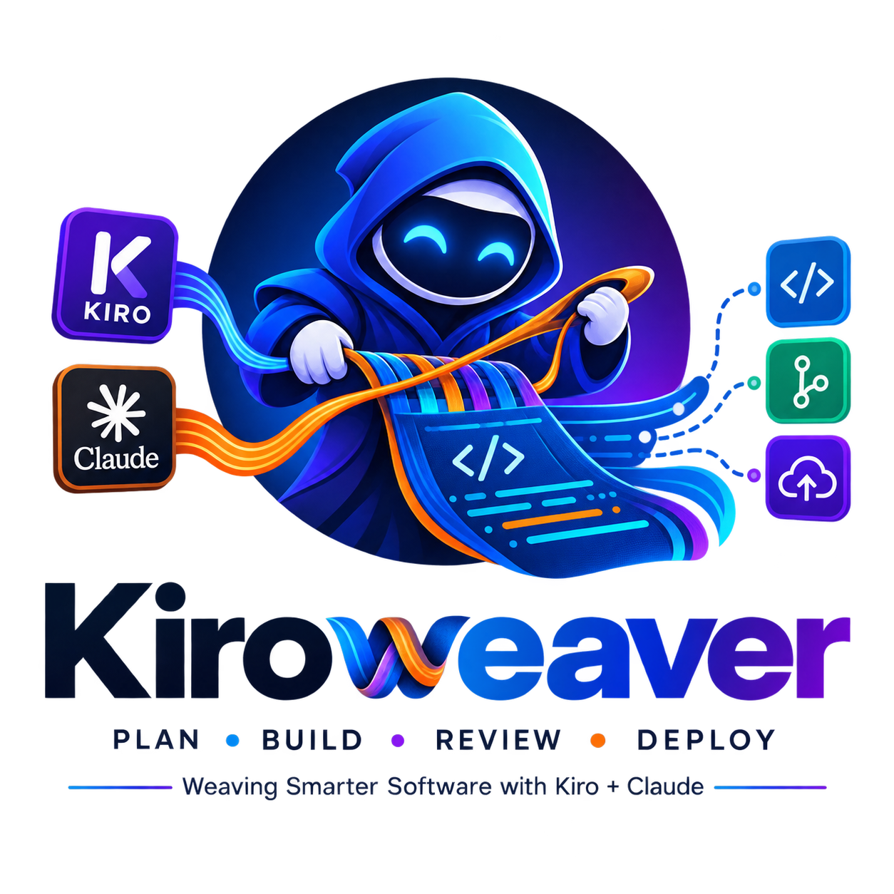

<p align="center">
  
</p>

# Kiroweaver

**Quality-optimized multi-agent orchestration for Kiro CLI.**

Every task routes to the optimal specialist agent model — not the most expensive, not the cheapest, but the highest quality per dollar.

---

## Table of Contents

- [Architecture](#architecture)
- [Agent Fleet](#agent-fleet)
- [Benchmarks vs Claude](#benchmarks-vs-claude)
- [Installation](#installation)
- [Usage](#usage)
- [Security & Scope](#security--scope)
- [Customization](#customization)
- [Troubleshooting](#troubleshooting)
- [License](#license)
- [Acknowledgments](#acknowledgments)

---

## Architecture

```
Kiroweaver Orchestrator (GPT 5.6 Luna · 0.10x · Terminal-Bench 84.7%)
                            │
                    Routes to specialist
                            ▼
        ┌──────────┬──────────┼──────────┬──────────┬──────────┐
        ▼          ▼          ▼          ▼          ▼          ▼
   ┌─────────┐ ┌─────────┐ ┌─────────┐ ┌─────────┐ ┌─────────┐
   │ Thinker │ │  Coder  │ │  Vision │ │ Designer│ │ Security│
   │  Luna   │ │  Qwen3  │ │  Haiku  │ │  Qwen3  │ │ MiniMax │
   │ 0.10x   │ │ 0.05x   │ │ 0.40x   │ │ 0.05x   │ │ 0.25x   │
   └─────────┘ └─────────┘ └─────────┘ └─────────┘ └─────────┘
                              │
                              ▼
                        ┌───────────┐
                        │   VAPT    │
                        │  MiniMax  │
                        │  + Strix  │
                        └───────────┘
```

**Closed system** — All traffic routes through the orchestrator. No external agents, no manual overrides.

---

## Agent Fleet

| Agent | Model | Cost | Benchmarks | Use Case |
|-------|-------|------|------------|----------|
| `kiroweaver` | GPT 5.6 Luna | 0.10x | Terminal-Bench 84.7% · Coding #6/147 | Orchestrator (entry point) |
| `kiroweaver-thinker` | GPT 5.6 Luna | 0.10x | Terminal-Bench 84.7% | Architecture, planning, API contracts |
| `kiroweaver-coder` | Qwen3 Coder Next | 0.05x | SWE-Bench 71.3% · Codeforces 2100 | Implementation, refactoring, tests |
| `kiroweaver-vision` | Claude Haiku 4.5 | 0.40x | Defect Detection 80% · OCR 61.6% | Screenshots, error logs, stack traces |
| `kiroweaver-designer` | Qwen3 + UI UX Pro Max | 0.05x | SWE-Bench 71.3% | Landing pages, dashboards, design systems |
| `kiroweaver-security` | MiniMax M2.5 | 0.25x | Vulnerability Detection 48% | CVE scans, secrets, OWASP, static review |
| `kiroweaver-vapt` | MiniMax M2.5 + Strix | 0.25x | 48% detection · Real exploit PoCs | Penetration testing, API security, CI/CD gates |

**Keyboard shortcuts** (within a Kiroweaver session):
- `Ctrl+0` Orchestrator
- `Ctrl+1` Thinker
- `Ctrl+2` Coder
- `Ctrl+3` Vision
- `Ctrl+4` Designer
- `Ctrl+5` Security
- `Ctrl+6` VAPT

---

## Benchmarks vs Claude

The core question behind Kiroweaver: for each agent's *specific job*, how does its cheaper specialist model compare to using a Claude model for the same task?

The comparison below uses **SWE-bench Verified** as the common yardstick, drawn from published third-party sources. Figures are approximate and change as models are released — treat them as directional, not absolute.

### SWE-bench Verified (coding capability)

| Model | SWE-bench Verified | Role in fleet |
|-------|:------------------:|---------------|
| MiniMax M2.5 | ~80% | Security, VAPT |
| Claude Opus (4.5–4.6 class) | ~80–81% | Reference (frontier) |
| Claude Haiku 4.5 | ~67–73% | Vision |
| Qwen3 Coder Next | ~70% | Coder, Designer |
| Claude Sonnet 4 class | ~70% | Reference (mid-tier) |

### Per-agent verdict

| Agent | Model | Job | vs Claude for that job |
|-------|-------|-----|------------------------|
| `kiroweaver-coder` | Qwen3 Coder Next | Implementation | Matches Claude Sonnet-4 class; trails top-tier Opus by ~10 pts on the hardest multi-file tasks |
| `kiroweaver-designer` | Qwen3 Coder Next | UI/UX + frontend | Same coding class as Sonnet-4; design intelligence comes from the UI UX Pro Max skill |
| `kiroweaver-security` | MiniMax M2.5 | Vulnerability detection | **Near-parity with Claude Opus on detection** — within ~1 pt, at a fraction of the cost |
| `kiroweaver-vapt` | MiniMax M2.5 | Pentest detection | **Near-parity with Claude Opus on detection**; Opus writes deeper fixes + more tests |
| `kiroweaver-vision` | Claude Haiku 4.5 | OCR, screenshots | Already a Claude model — the cost-efficient Claude, not a competitor to it |
| `kiroweaver-thinker` | GPT 5.6 Luna | Planning | Low-risk role (output is a reviewable plan); model benchmark unverified — see caveat |

### Where cheap holds, where Claude pulls ahead

- **Detection work (security, VAPT):** cheap models reach genuine parity with Claude Opus. Biggest, safest win.
- **Generation work (coder, designer):** cheap models match mid-tier Claude (Sonnet class); top-tier Opus leads by ~10 pts on the hardest problems.
- **The consistent pattern:** cheap models *find the right answer* about as often; Claude Opus does *more around it* — more thorough fixes, more tests, harder problems. The gap is thoroughness and ceiling, not correctness.

**Practical rule:** keep the cheap defaults for the ~80% of routine work; reserve a top-tier Claude model for the genuinely hard coding tasks and production-grade security remediation where fix depth matters.

> **Caveats.** SWE-bench figures are sourced from public third-party benchmarks and are approximate. The orchestrator/thinker model (`gpt-5.6-luna`) does not map to a benchmark this project can independently verify; its listed scores are unverified. Benchmark numbers reflect detection/coding capability, not fix thoroughness or test coverage, where frontier Claude models still lead.

---

## Installation

### Prerequisites

- Kiro CLI installed and authenticated
- Python 3.x (for UI UX Pro Max skill scripts)
- Docker (for Strix VAPT agent)

### Clone and Install Agents

```bash
git clone https://github.com/awskrishnak/kiroweaver.git ~/.kiro/agents/kiroweaver
mkdir -p ~/.kiro/agents
cp ~/.kiro/agents/kiroweaver/*.md ~/.kiro/agents/
```

### Install Skills

```bash
# UI UX Pro Max (for designer)
npm install -g ui-ux-pro-max-cli
uipro init --ai kiro --global

# Strix (for VAPT)
curl -sSL https://strix.ai/install | bash
# or: npx skills add usestrix/strix
```

### Configure Strix (optional)

```bash
export STRIX_LLM="openrouter/z-ai/glm-5.3"
export LLM_API_KEY="your-api-key"
```

### Verify

```bash
kiro-cli --v3 --agent kiroweaver
```

Expected output: `Kiroweaver Orchestrator (Luna). CLOSED SYSTEM. Quality-optimized routing.`

---

## Usage

### Start Session

```bash
kiro-cli --v3 --agent kiroweaver
```

### Spawn Sub-Agents

```bash
/spawn kiroweaver-thinker  "Design auth flow with JWT"
/spawn kiroweaver-coder    "Implement JWT middleware"
/spawn kiroweaver-vision   "Review this screenshot"
/spawn kiroweaver-designer "Build a SaaS landing page"
/spawn kiroweaver-security "Audit dependencies for CVEs"
/spawn kiroweaver-vapt     "Pentest https://staging.myapp.com"
```

### Parallel Execution

Spawn up to 4 agents in parallel:

```bash
/spawn kiroweaver-coder "Write tests" and /spawn kiroweaver-thinker "Review edge cases"
```

### Keyboard Shortcuts

Use within a Kiroweaver session:
- `Ctrl+0` Orchestrator (GPT 5.6 Luna · 0.10x)
- `Ctrl+1` Thinker (GPT 5.6 Luna · 0.10x)
- `Ctrl+2` Coder (Qwen3 Coder Next · 0.05x)
- `Ctrl+3` Vision (Claude Haiku 4.5 · 0.40x)
- `Ctrl+4` Designer (Qwen3 + UI UX Pro Max · 0.05x)
- `Ctrl+5` Security (MiniMax M2.5 · 0.25x)
- `Ctrl+6` VAPT (MiniMax M2.5 + Strix · 0.25x)

---

## Security & Scope

### Read-Only Agents
- `kiroweaver-security` — Read-only auditing only
- `kiroweaver-vapt` — Read-only reporting only
- `kiroweaver-thinker` — Read-only planning only

### Authorization Requirements
- Active VAPT testing requires explicit user authorization before execution
- VAPT agents produce real exploit PoCs but never execute harmful payloads

### Closed System Constraints
- No external agents (`/agent default` blocked)
- No manual model overrides (`--model` flags ignored)
- No mid-session skill loading
- Skill model directives discarded (skills run on assigned agent model or not at all)

---

## Customization

### Add Custom Agents

Edit existing agent definitions or create new `kiroweaver-*.md` files in the root directory. Each file defines one agent with fixed routing to the orchestrator.

**Constraints:**
- All agent filenames must start with `kiroweaver-`
- Agent IDs in each file must match the filename (e.g., `kiroweaver-custom.md` defines `kiroweaver-custom`)
- Routing table in the orchestrator automatically discovers new agents via pattern matching
- Keyboard shortcuts are assigned sequentially (Ctrl+0 reserved for orchestrator)

### Rebrand Fleet

To rebrand the entire fleet:

1. Rename all `kiroweaver-*.md` files to use your new prefix (e.g., `myorg-*.md`)
2. Update the `agent:` field in each file to match the new filename
3. The orchestrator's routing table automatically reflects the new agent IDs

**Important:** Preserve the closed-system naming and routing conventions. Do not remove the `kiroweaver` orchestrator entry point.

---

## Troubleshooting

### Common Issues

| Problem | Solution |
|---------|----------|
| Accidentally switched to `/agent default` | Type `/agent kiroweaver` to return |
| Costs unexpectedly high after `--model` flag | Exit and restart with `kiro-cli --v3 --agent kiroweaver` |
| Skill trying to use expensive model | Ignored automatically — "Skill model override blocked" confirms protection is working |
| Agent not found | Verify files in `~/.kiro/agents/kiroweaver*.md` |
| Designer skill not loading | `npm install -g ui-ux-pro-max-cli@latest && uipro init --ai kiro --global` |
| Strix not found (VAPT) | `curl -sSL https://strix.ai/install \| bash` |
| Model unavailable | Agents fall back to default model — temporary, not recommended |

### Benchmarks Reference

- **Qwen3 Coder Next**: 71.3% SWE-Bench — competes with models 10–20x larger
- **GPT 5.6 Luna**: #6 global coding rank — above Opus 4.8 on Terminal-Bench
- **MiniMax M2.5**: 48% detection — 2.4x better than Sonnet 5's 19.6%
- **Claude Haiku 4.5**: 80% defect detection — only proven OCR for error logs

---

## License

MIT — use it, fork it, rebrand it.

---

## Acknowledgments

- Kiro by Amazon
- UI UX Pro Max by NextLevelBuilder
- Strix by Strix AI
- Caveman by Julius Brussee

Built for specialists, not generalists.
